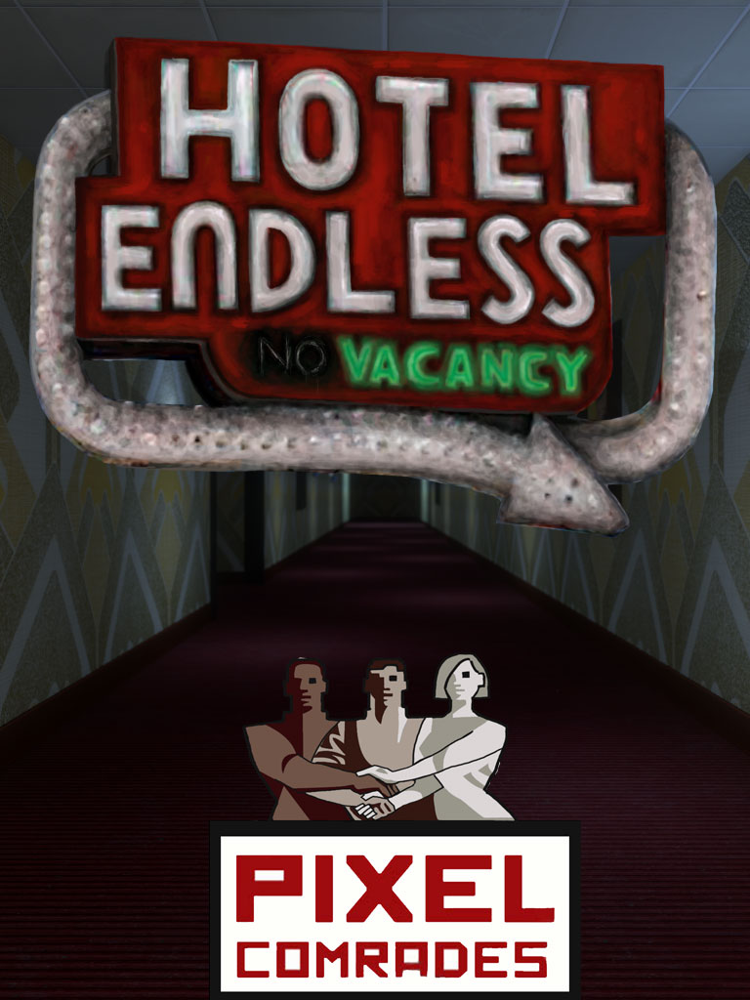
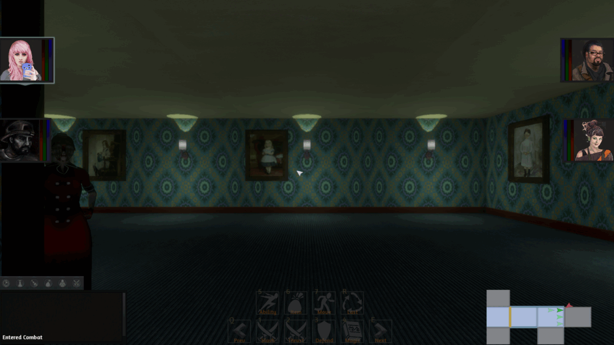

# Hotel Endless

## The game

Explore an impossible 1970s hotel as a single first-person investigator. Scrounge
for supplies, learn its routes, deal with its inhabitants, and call on a small
collection of demons for brief, useful interventions. Going farther should feel
tempting even when coming back is the sensible choice.

This is a new game carrying forward the atmosphere and basic setup of the lost
Hotel Endless prototype. Its old mechanics are historical context, not a
reconstruction specification. The surviving hotel, wallpaper, carpet, and
paranormal expedition are the useful inheritance.

This document owns product direction. [Architecture](architecture.md) describes
what is actually implemented; Den project `rusty-hotel` owns tasks, dependencies,
progress, reviews, and playtest evidence. The initial playable scope below is a
working design baseline, not a claim that those features exist.

## Agreed pillars

- **Inhabit the hotel.** Recognizable rooms, furnishings, service routes, and
  expedition equipment give the impossible building a mundane physical life.
  Wandering should be worthwhile between encounters.
- **One explorer, free movement.** First-person movement and aiming are
  continuous. There is no grid movement, party formation, or tactical party UI.
- **Slow, deliberate danger.** Read attacks, manage distance and doorways, commit
  to an action, and decide whether a fight is worth its cost. Shadow Tower Abyss
  is the requested reference for pace and resource-minded first-person action.
- **Scrounge and improvise.** Health, ammunition, and summon supplies make routes
  and discoveries matter. Survival-horror mechanics support exploration without
  making frightening the player the purpose of the game.
- **Small, memorable summons.** The demon-collecting flavor of Shin Megami Tensei
  informs the relationship, but a demon acts as a special attack or temporary
  summon. It is not another fully managed party member.
- **Strange, sometimes funny, still dangerous.** Curious residents, obsolete
  equipment, tired luxury, and earnest investigations can coexist with combat.
  Jump scares, pursuit by an invulnerable stalker, and oppressive helplessness
  are not foundational mechanics.

## Setting and visual identity

The hotel is larger on the inside. A missing paranormal expedition provides a
reason for scientific instruments, field notes, and magnetic recordings among
guest rooms and public spaces. The player's exact identity, date of arrival,
and relationship to that expedition remain open.

The supplied original images are durable visual references:

These are unchanged user-supplied images from the original prototype. Their
party portraits, combat interface, logos, and layout do not specify the new UI.

The room image supplies a particularly useful material hierarchy: large,
repeating blue/teal/olive wallpaper motifs above a dark, finer carpet pattern;
wood trim and framed pictures interrupt the repeat; low ceilings and separated
light pools give plain geometry character. The cover adds angular wallpaper,
burgundy carpet, and a strong corridor perspective. They are related palettes,
not a requirement to reproduce one exact room.

Build a small family of compatible materials before accumulating props:

- A blue-green medallion wallpaper and an angular olive/gray alternative.
- Dark patterned carpet, with a burgundy corridor variant.
- Restrained wood trim, painted ceiling, doors, and period wall lights.
- Analog research props that look carried into a functioning hotel: tape
  recorders, portable instruments, notebooks, cables, and cases.

Original recovered textures or newly generated ones are both suitable. New
texture sources should be flat, seamless surface patterns with consistent motif
scale, no baked perspective, and no painted room lighting. Test tiling, seams,
distance shimmer, and readability while walking in the actual Engine scene.
The pattern should read at standing eye height, not just in a texture preview.

Choose a coherent texture density, geometry detail, palette, and lighting range
for the whole scene. Creatures and props must belong beside the wallpaper; do
not repeat the old mismatch between photographic surfaces and unrelated asset
styles. Darkness can frame the space while doors, supplies, and enemy tells
remain legible. Static-like dissolution is a promising optional effect, not a
reason to cover the view with continuous visual noise.

Sound should establish occupancy and material: carpeted footsteps, ventilation,
distant plumbing, tape hiss, elevator machinery, and distinct encounter cues.
Avoid relying on loud surprise stingers to supply the atmosphere.

## Exploration loop

1. Prepare in a recognizable refuge and choose equipment and a spirit.
2. Follow an unfamiliar route and search rooms for supplies or information.
3. Decide whether to fight, spend a summon, retreat, or take another route.
4. Find something worth keeping and open a useful connection back.
5. Return, secure the find, and choose the next excursion with better knowledge.

A shortcut, working service, useful resident, or understandable landmark can be
as valuable as a weapon. Room numbers, furnishings, lighting, and named places
should help navigation. Repetition makes a hotel plausible; variation makes a
particular room memorable.

The larger direction includes procedural hotel layouts. Begin with a compact
authored excursion to establish scale, pacing, and room identity. Then vary its
room connections and contents while preserving reachable objectives, a return
route, resource opportunities, and recognizable landmarks. A layout grid is an
authoring option; it never constrains the player to grid movement. Endless
streaming, impossible-space rendering, and an infinite world are not implied by
the name or needed for the first excursion.

## Resource and combat baseline

Start with health, ammunition, and one shared summon resource. A small readable
inventory should make discoveries and expenditure understandable. Exact slot
counts, supply quantities, damage, and speeds belong in tunable content.

The first excursion needs a basic close-range fallback and one scarce ranged
option. Scarcity should change decisions without leaving ordinary progress
dependent on finding the one remaining bullet. Avoid mandatory fights that
require an already exhausted consumable; alternate routes or readable retreat
should remain meaningful.

Enemies need clear windup, commitment, and recovery. Two distinct encounter
behaviors are enough to test the loop: one that pressures distance and one that
makes timing or cover useful. Final creature identities are still open. Keep
encounters sparse enough for rooms and exploration to matter. Do not inherit
Doom movement speed, horde density, or weapon cadence from donor code.

Start without hunger, thirst, durability meters, crafting trees, elaborate
status systems, or loot affix rolls. Add a system only when it improves a real
decision the existing loop cannot express.

## Spirits

Use a small collection with one equipped spirit as the initial design baseline.
The first excursion contains one discoverable spirit with one clearly useful
manifestation. Give it an identifiable entrance, behavior, and departure so it
feels like a creature briefly joining the player.

Possible roles include interrupting an attack, holding an enemy at a doorway,
or exposing a concealed presence. These are alternatives to choose from, not
three required systems. Start with one bounded combat intervention and a short
acquisition encounter or bargain. Spend the shared resource only when a summon
is actually accepted; unavailable or invalid use must remain understandable.

No permanent follower AI, independent equipment, party formation, fusion tree,
or detailed demon leveling is required. Later spirits should broaden tactics
and personality before increasing management complexity.

## Interface and interaction

The rendered world is the primary interface. Walk to a door, look at a find,
use a recording, meet a spirit, and operate the refuge through ordinary controls.
Show a small focus prompt where it helps, a legible resource readout, and a
compact inventory. A growing dashboard of commands is not the game.

Use a conventional mouse/keyboard first-person baseline: move, look, interact,
attack, summon, inventory, and pause. Bindings, look sensitivity, movement speed,
and eye height should be straightforward to tune. Focus loss and pause must clear
held actions. Controller support should use Engine input facilities when added;
the first excursion does not require a separate controller acceptance campaign.

The DOM companion may display facts and submit semantic intents. It does not
own gameplay state, target selection, world rendering, or time.

Establish the curated UI immediately after the FPS bootstrap, before adding
feature controls. [The interface contract](ui.md) defines the compact HUD,
field case for supplies/spirits, contextual reading/refuge screens, and pause
menu. Extend those surfaces deliberately as gameplay arrives.

Developer and agent hooks belong in the opt-in Engine command console. It is a
useful place to test unfinished behavior, clearly separated from the player
interface. A feature reachable only by command is not finished player gameplay;
its UI/world integration remains planned work. Never substitute a scrolling
test-button panel for the intended interaction.

## First complete excursion

Aim for roughly 10–15 minutes, adjusted by play rather than treated as a quota:

- One refuge, a corridor, several distinct rooms, and a service connection that
  becomes a shortcut back.
- A coherent wallpaper/carpet/light treatment and a few expedition props.
- Searchable supplies, a usable inventory, healing, and scarce ammunition.
- Two readable enemy behaviors, basic close-range and ranged actions.
- One acquired spirit and its visible, consequential temporary manifestation.
- One expedition find worth returning with and one piece of contextual writing
  or recorded evidence; finished voice acting is not required.
- A clear return interaction, saved progress, and a recoverable failure state.

For this slice, use a refuge checkpoint: returning commits inventory, collected
finds, acquired spirits, and changed world state together. Defeat restores the
whole last checkpoint, including supplies and encounters, so retrying neither
duplicates loot nor permanently consumes the resources needed to proceed.
This is a prototype baseline; final death penalties and saving away from the
refuge remain open. Save meaningful product values using Engine persistence.

Judge the excursion by ordinary play: can a new player orient, find supplies,
understand the cost of an encounter, use the spirit, open the shortcut, and
return with something valuable? Does the room still feel worth looking at after
the enemy is gone? Keep original captures and the action sequence in Den.

## Deliberately open

- Protagonist, expedition chronology, and the larger objective.
- Run structure versus a persistent hotel, final defeat costs, and wider saves.
- The spirit roster, acquisition rules, and final summon-resource fiction.
- Inventory capacity and whether any later maintenance mechanic earns a place.
- How strongly procedural floors rearrange after they have been visited.
- The role of memory interpretation puzzles. The old memory-stone locks are a
  promising idea to revisit after exploration works, not a first-slice gate.

## Implementation boundaries and references

Use the template's safe C# product and packaged Rusty Engine. Engine owns input
delivery, admitted updates, camera/rendering resources, spatial mechanisms,
content delivery, and persistence primitives. Hotel owns its authored rooms,
rules, inventory, encounters, spirit behavior, and expedition state.

[Reuse guidance](reuse.md) identifies sibling patterns worth inspecting. Adopt
small pieces once into Hotel ownership; do not depend on sibling repositories,
import their frameworks wholesale, or duplicate mechanisms already in the pin.

The archival background came from both replies in the ChatGPT conversation
**Hotel Endless Archive Hunt**, read for this design. Its historical claims are
background research rather than mechanically binding requirements. The two
images above were supplied directly by the owner. Shadow Tower Abyss supplies
the owner's gameplay reference; Shin Megami Tensei supplies the simplified
demon-collection reference.
